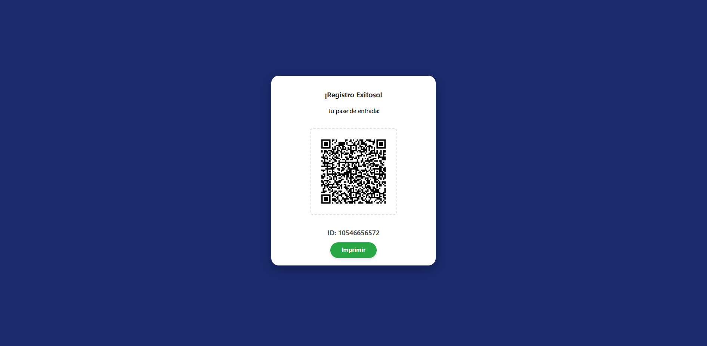

# 🎫 Sistema de Registro con QR - Proyecto001

Este proyecto es un sistema de registro de asistentes desarrollado con **PHP** y **CSS**. Permite capturar datos de usuarios, generar un código QR único con su información y mostrar un pase de entrada listo para imprimir.

## 🚀 Funcionalidades
* **Formulario Moderno:** Interfaz limpia con validación de campos.
* **Generador de QR:** Creación automática de códigos QR con los datos del asistente.
* **Tarjeta de Éxito:** Diseño profesional para mostrar el pase generado.
* **Optimizado para Impresión:** Estilo CSS específico para que solo se imprima el pase.

## 🛠️ Tecnologías
* **Backend:** PHP (con librería phpqrcode)
* **Frontend:** HTML5, CSS3 (Flexbox)
* **Servidor:** Apache / Localhost (XAMPP)

## 📸 Capturas del Proyecto

### Formulario de Registro

### Pase de Entrada Generado

## 🔧 Instalación
1. Clona el repositorio en tu carpeta `htdocs`.
2. Asegúrate de tener la carpeta `/temp` con permisos de escritura.
3. Configura tu `conexion.php` con los datos de tu base de datos.
4. Accede a `localhost/proyecto001/registro.html`.

---
Desarrollado por [santiago0228](https://github.com/santiago0228)